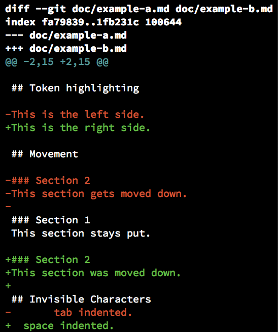
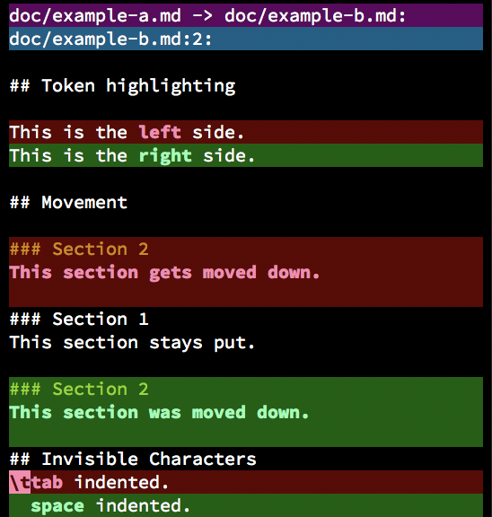

# Same-same: a Git diff highlighter

Same-same is a git diff highlighter like Git's [contrib/diff-highlight](https://github.com/git/git/tree/master/contrib/diff-highlight) and [diff-so-fancy](https://github.com/so-fancy/diff-so-fancy).

The highlighter accomplishes several things:
* Highlights add/remove lines using background colors.
* Tokenizes changed blocks and highlights per-token changes using text colors.
* Detects moved lines and highlights them with separate (yellowish) text colors.
* Distinguishes metadata lines, thereby decreasing visual clutter.
* Removes leading '+'/'-'/' ' characters from hunk lines, which makes copy/paste from the terminal more convenient.
* Reformats chunk headers to look like "dir/source.ext:line_num:", which allows editors such as VSCode to click through the source location.

# License

Same-same is dedicated to the public domain under CC0: https://creativecommons.org/publicdomain/zero/1.0/.

# Requirements

Same-same currently requires Python 3.x and an `xterm-256` compatible terminal, as it generates 256-color output.

Same-same has been tested only on macOS 10.13 and Apple Terminal.

# Installation

The program is a standalone Python script. To install, just copy it to some location on your shell's PATH, e.g.:

    .../same-same $ cp same-same.py /usr/local/bin/same-same

Or you can install the program as a symlink to the source file in the developer directory:

   .../same-same $ ./install-dev.sh

## Configure Git

Then update your git configuration:

    $ git config --global core.pager 'same-same | LESSANSIENDCHARS=mK less --RAW-CONTROL-CHARS'
    $ git config --global interactive.diffFilter 'same-same -interactive | LESSANSIENDCHARS=mK less --RAW-CONTROL-CHARS'

Or edit your `~/.gitconfig` or project `.gitconfig` by hand:

    [core]
      pager = same-same | LESSANSIENDCHARS=mK less --RAW-CONTROL-CHARS
    [interactive]
      diffFilter = same-same -interactive | LESSANSIENDCHARS=mK less --RAW-CONTROL-CHARS

As an alternative or in addition to `core.pager`, you can set any of `pager.log`, `pager.show`, and `pager.diff` to use different highlighter/pager combinations for the various git commands.

Due to recently observed slow start times using Python's `entry_points`/`console_scripts`, I am not bothering with a `setup.py` entrypoint at this time.

# Screenshots

An example diff straight from git:

The same diff highlighted with by same-same:

# Debugging

If `same-same` misbehaves, please report the problem (with a repro if possible) as a GitHub issue.

To put `same-same` in passthrough mode, set the environment variable `SAME_SAME_OFF`.

To put `same-same` in debug mode (just classify each line, then print its kind and repr), set `SAME_SAME_DBG`.

# Algorithms

Same-same does two things that are interesting algorithmically: movement detection, and per-token highlighting.

## Movement detection

The movement detector runs first, as follows:
* Find all unique removed lines and unique added lines, ignoring whitespace (this allows for detection even with changed indentation).
* For each unique line that was both added and removed:
  * Greedily expand the moved block backwards and forwards, again ignoring whitespace but also allowing non-unique lines to match.

## Per-token highlighting

Per-token highlighting is performed per "chunk", where a chunk is a block of consecutive removed and/or added lines. This is in contrast to git's notion of a "hunk", which also includes context lines. For each chunk:
* Assemble a list of tokens for each side, including newline tokens.
* Diff the lists on a token-by-token basis.
  * Currently we use Python's builtin `difflib.SequnceMatcher` algorithm, and treat non-newline whitespace tokens as junk (a feature of `SequenceMatcher`).
  * Anecdotally, I think that the "Patience" algorithm produces better diffs than `difflib` does, and Git's "histogram" algorithm is purported to be better still. I would love to find the time to write (or collaborate on!) a public domain implementation.
* Iterate over the resulting diff sequence and output the sequence of tokens with highlight colors inserted.
* Replace the text for each line with highlighted sequences.

# Notes

I learned some interesting things that may be helpful for others creating git highlighters, other git tools, and tools with color console output.

## Git can do line movement detection

`git diff` has a new `--color-moved[=<mode>]` option to detect line movement, and offers several modes. Same-same ignores all colors in the diff and does its own movement detection. This is partly out of simplicity, but also to allow for experimentation and improvements to the movement detection algorithm.

## Limitation of Git's interactive mode

`git add -p` (interactive staging) works by slicing the diff by line positions. Therefore if a highlighter omits or inserts lines, then the output will get sliced incorrectly and will not make sense. For this reason, `same-same -interactive` disables the omission of unhelpful metadata lines and dims them instead.

## Coloring to end-of-line

Some terminals, including Apple Terminal, make it difficult to set the background color of a complete line without printing trailing spaces to fill the screen. Filling with spaces requires querying for the terminal width, and is an unacceptable hack because it cannot cope with a resized terminal window. [This StackOverflow answer](https://stackoverflow.com/a/20058323) shows how to use the [ANSI CSI sequence](https://en.wikipedia.org/wiki/ANSI_escape_code#CSI_sequences) for "erase to end-of-line" (`'\x1b[K'` or `'\x1b[0k'`) to get Terminal to highlight from the current position to the right margin.

This trick allows Same-same to use a different highlighting style than GitHub: the background color is used to indicate the line-by-line diff, and the text color is used to indicate the per-token diff.

## Getting Less to respect the clear-to-eol trick

By default, `less` will strip out the "erase" code used above, but the `--RAW-CONTROL-CHARS` option, in conjunction with the `LESSANSIENDCHARS=mK` environment variable tells it to leave both SGR (color) and erasure sequences in the text stream.

# Contribution

Contributors are welcome! Please get in touch via GitHub issues or email to discuss.

## Configurable colors

One obvious addition would be to query `os.environ` for custom colors.
